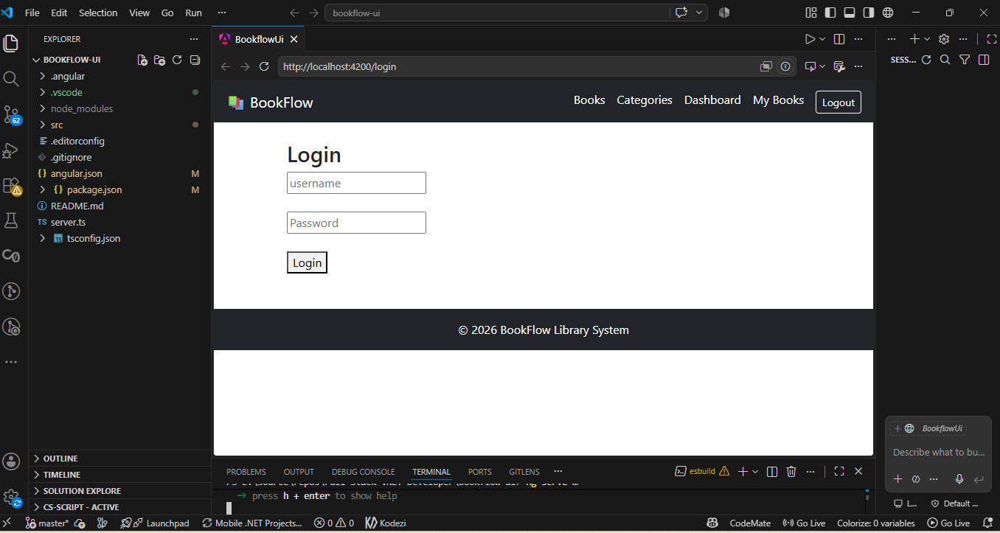
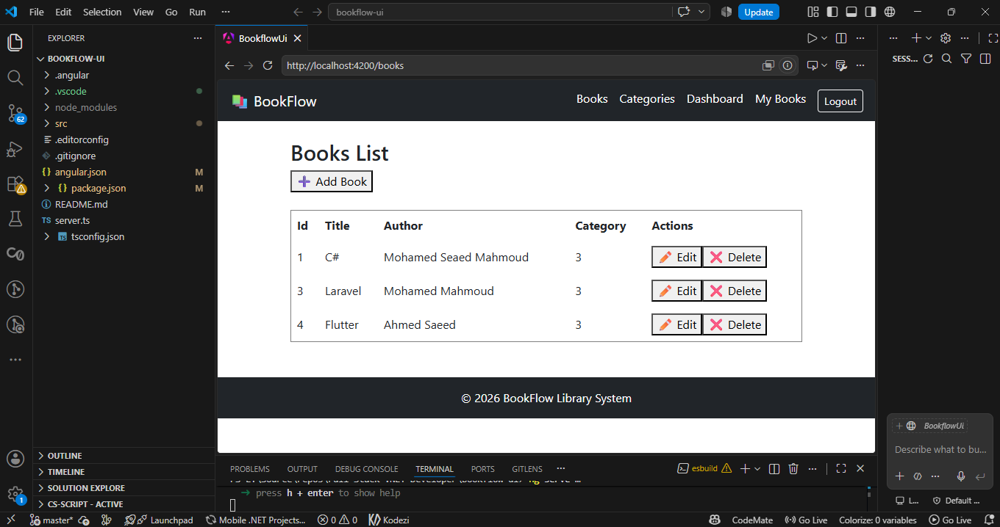
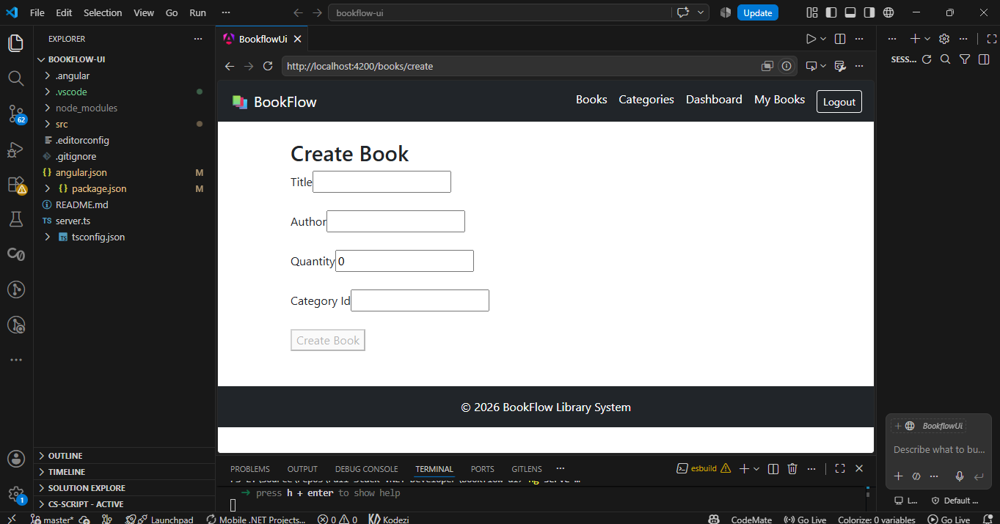
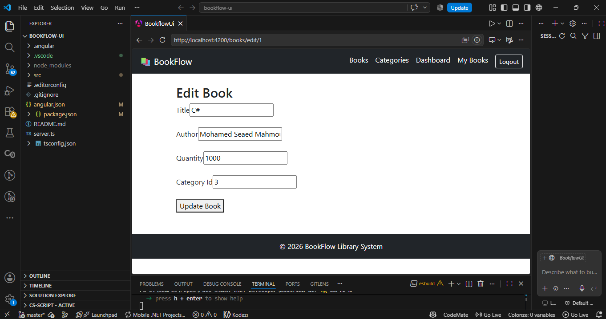
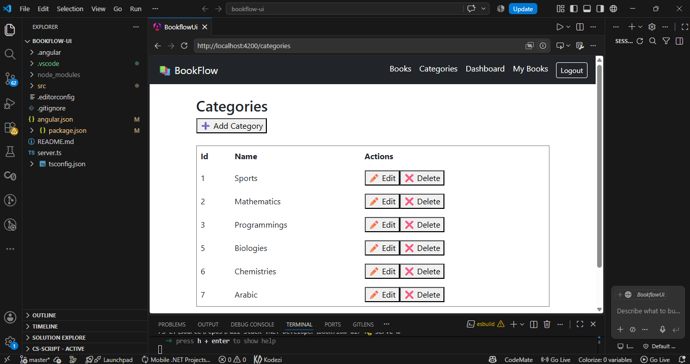
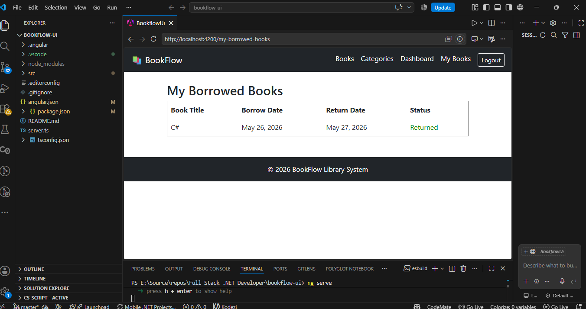
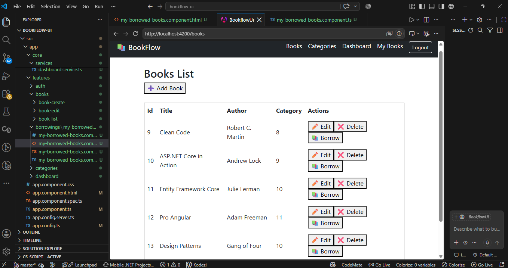
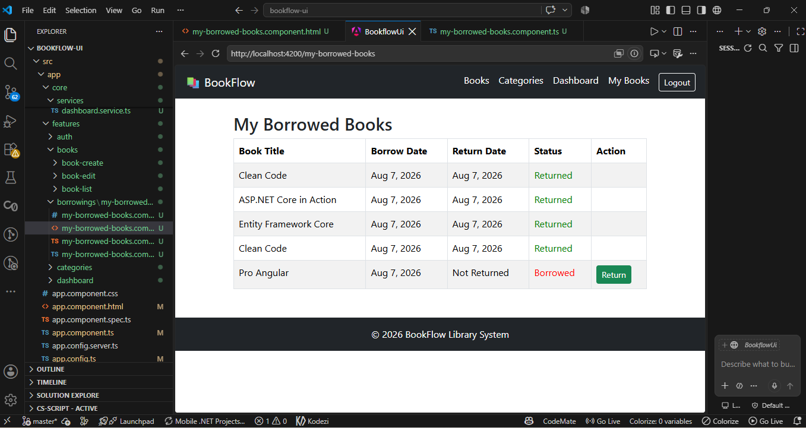
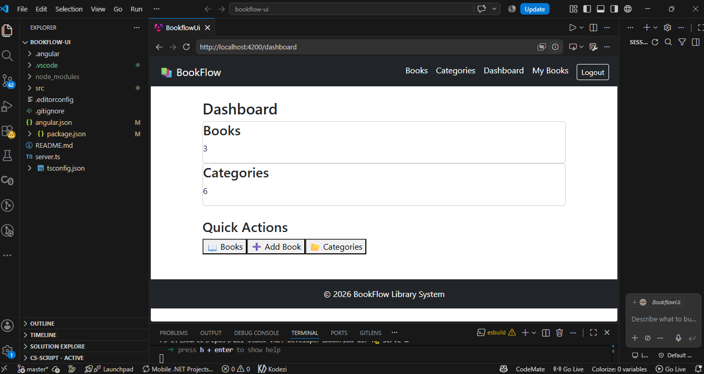
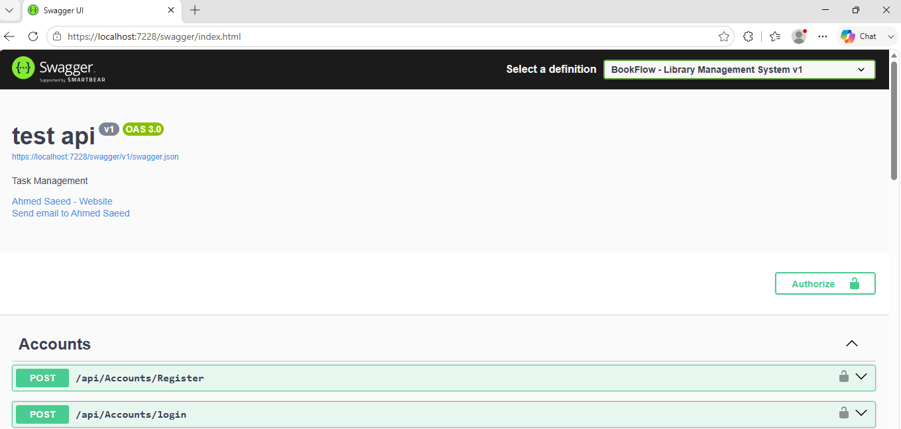

<h1 align="center">📚 BookFlow - Library Management System</h1>

<p align="center">
A scalable full-stack <b>Library Management System</b> built with ASP.NET Core Web API and Angular, designed to simulate real-world enterprise library operations with secure authentication and role-based access control.
</p>

<p align="center">
  
  
  
  
</p>

---

## 🚀 Overview

**BookFlow** is a full-stack enterprise-style system that manages books, users, and borrowing workflows.

The project demonstrates:
- Scalable backend architecture (ASP.NET Core Web API)
- Modern frontend development (Angular)
- Secure authentication system
- Real-world business workflow simulation

It is designed following **Clean Architecture principles** and industry best practices.

---

## ✨ Key Features

### 🔐 Authentication & Authorization
- JWT-based authentication
- Role-based access control (Admin / User)
- Secure API endpoints

### 📚 Library Management
- Book CRUD operations
- Category management system
- Advanced borrowing & return workflow

### 🔄 Borrowing System
- Borrow & return tracking
- User-specific borrowing history
- Business logic validation for availability

### 🎨 Frontend Features (Angular)
- Responsive UI design
- Reactive Forms validation
- HTTP integration with Web API
- Role-based UI rendering

### 🧠 Backend Engineering Features
- CQRS pattern using MediatR
- Centralized exception handling
- DTO-based API design
- Clean separation of concerns

---

## 🛠 Tech Stack

### 🖥 Backend
- ASP.NET Core Web API
- C#
- Entity Framework Core
- SQL Server
- ASP.NET Identity
- JWT Authentication
- MediatR (CQRS)
- AutoMapper

### 🌐 Frontend
- Angular
- TypeScript
- Reactive Forms
- HttpClient
- Bootstrap / Angular Material

---

## 🧱 Architecture

The system follows a **Clean Architecture + CQRS hybrid design**:

- 🏛 Presentation Layer (API Controllers)
- 🧠 Application Layer (CQRS - Commands & Queries)
- 🗄 Domain Layer (Core Business Logic)
- 💾 Infrastructure Layer (Database & External Services)

### Key Principles:
- Separation of Concerns
- Dependency Injection
- SOLID Principles
- Maintainable & scalable structure

---

## 🔐 Roles & Permissions

### 👨‍💼 Admin
- Manage books, categories, and users
- Full system access

### 👤 User
- Browse books
- Borrow & return books
- View personal borrowing history

---

---

## 📸 Screenshots

### 🔐 Login Page

<p align="center">
  
</p>

---

### 📚 Books Management

<p align="center">
  
</p>

---

### ➕ Create Book

<p align="center">
  
</p>

---

### ✏️ Edit Book

<p align="center">
  
</p>

---

### 📂 Categories Management

<p align="center">
  
</p>

---

### 👤 My Borrowed Books

---
<p align="center">
  
</p>

---

### 📖 Borrow Book

<p align="center">
  
</p>

---

### 🔄 Return Book

<p align="center">
  
</p>

---

### 📊 Dashboard

<p align="center">
  
</p>

---

### 📑 Swagger API

<p align="center">
  
</p>

---

---

## ⚙️ Setup Instructions

### 🔧 Backend
```bash
cd BookFlow.API
dotnet restore
dotnet run
``` id="bflw1"

---

### 🌐 Frontend
```bash
cd BookFlow.Client
npm install
ng serve
``` id="bflw2"

---

## 🗄 Database

- SQL Server
- Code First Approach
- Entity Framework Core Migrations enabled
- Relational structure for Books, Users, Borrowing records

---

## 🎯 What This Project Demonstrates

- Full-stack system design (API + Angular)
- Real-world business workflow implementation
- Secure authentication & authorization (JWT + Roles)
- Scalable backend architecture (CQRS + Clean Architecture)
- Professional frontend integration
- Production-style project structuring

---

## 🚀 Future Improvements

- Email notifications for overdue books
- Advanced analytics dashboard
- Filtering & search optimization
- Docker containerization
- Cloud deployment (Azure / AWS)
- Caching layer (Redis)

---

## 💡 Key Takeaway

> “A real full-stack system is not just frontend + backend — it is architecture, security, and user experience working together.”

---

<p align="center">
🚀 Built with focus on enterprise-grade full-stack engineering and scalable system design
</p>
